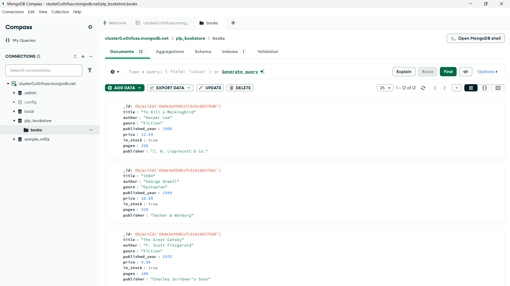
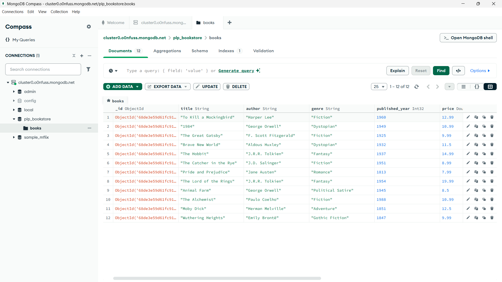

### PLP Bookstore MongoDB Project

### Overview
This project demonstrates MongoDB setup, CRUD operations, advanced queries, aggregation pipelines, and indexing using a sample bookstore database.

## Getting Started
Prerequisites
Node.js installed

### Installation
Clone the repository:

  git clone https://github.com/PLP-MERN-Stack-Development/mongodb-data-layer-fundamentals-and-advanced-techniques-kwanelexavi.git
  
  cd plp_bookstore

### Install dependencies:

  npm init -y
  npm install mongodb

### Insert sample data:

  node insert_books.js

### Run queries:

  node queries.js

### Project Features
# Task 1: MongoDB Setup
  ✔️ Database plp_bookstore created
  ✔️ Collection books created

# Task 2: CRUD Operations
  ✔️ Insert, Find, Update, Delete queries implemented

# Task 4: Aggregation Pipelines
  ✔️ Average price by genre
  ✔️ Author with most books
  ✔️ Grouping books by decade

# Task 5: Indexing
  ✔️ Index on title
  ✔️ Compound index on author + published_year
  ✔️ Performance tested with explain()

### Example Querie:
# Find all Fiction books:

  db.books.find({ genre: "Fiction" })

# Update book price:

  db.books.updateOne({ title: "1984" }, { $set: { price: 15.99 } })

# Aggregation - Average price by genre:

  db.books.aggregate([{ $group: { _id: "$genre", avgPrice: { $avg: "$price" } } }])

### Screenshots

.

### Author
Kwanele Mntambo – PLP MongoDB Project
